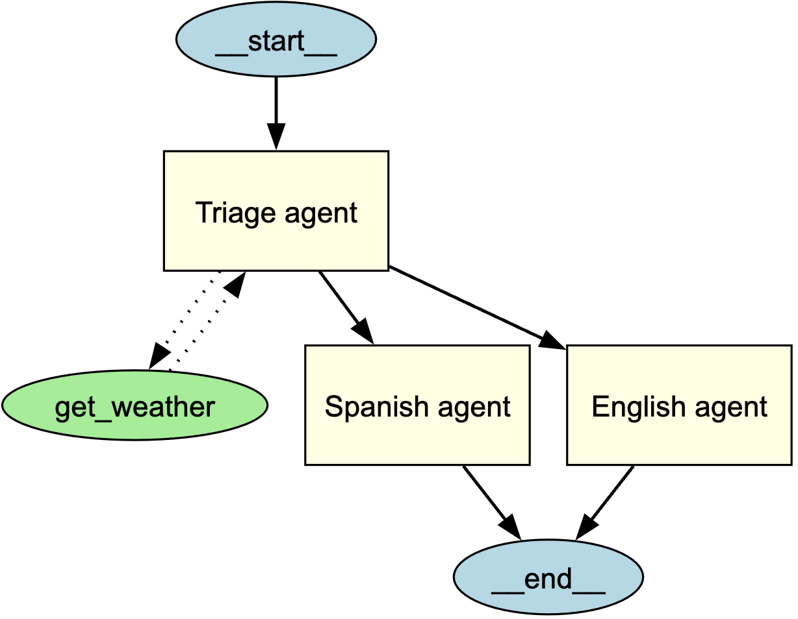

---
search:
  exclude: true
---
# エージェント可視化

エージェント可視化を使用すると、 ** Graphviz ** を使ってエージェントとその関係を構造的なグラフィカル表現として生成できます。これは、アプリケーション内でエージェント、ツール、ハンドオフがどのように相互作用するかを理解するのに役立ちます。

## インストール

オプションの `viz` 依存関係グループをインストールします:

```bash
pip install "openai-agents[viz]"
```

## グラフの生成

`draw_graph` 関数を使用してエージェントの可視化を生成できます。この関数は有向グラフを作成し、次のように表現します:

- ** エージェント ** は黄色のボックスで表示されます。
- ** ツール ** は緑色の楕円で表示されます。
- ** ハンドオフ ** は一方のエージェントから別のエージェントへの有向エッジで示されます。

### 使用例

```python
from agents import Agent, function_tool
from agents.extensions.visualization import draw_graph

@function_tool
def get_weather(city: str) -> str:
    return f"The weather in {city} is sunny."

spanish_agent = Agent(
    name="Spanish agent",
    instructions="You only speak Spanish.",
)

english_agent = Agent(
    name="English agent",
    instructions="You only speak English",
)

triage_agent = Agent(
    name="Triage agent",
    instructions="Handoff to the appropriate agent based on the language of the request.",
    handoffs=[spanish_agent, english_agent],
    tools=[get_weather],
)

draw_graph(triage_agent)
```



これにより、 ** triage agent ** の構造とサブエージェントおよびツールへの接続を視覚的に表現したグラフが生成されます。


## 可視化の理解

生成されたグラフには次の要素が含まれます:

- エントリーポイントを示す ** start ノード ** ( `__start__` )  
- 黄色で塗りつぶされた ** 四角形 ** で示されるエージェント  
- 緑色で塗りつぶされた ** 楕円 ** で示されるツール  
- 相互作用を示す有向エッジ  
  - エージェント間のハンドオフには ** 実線矢印 **  
  - ツール呼び出しには ** 破線矢印 **  
- 実行終了地点を示す ** end ノード ** ( `__end__` )

## グラフのカスタマイズ

### グラフの表示
デフォルトでは、`draw_graph` はグラフをインラインで表示します。別ウィンドウで表示するには、次のように記述します:

```python
draw_graph(triage_agent).view()
```

### グラフの保存
デフォルトでは、`draw_graph` はグラフをインラインで表示します。ファイルとして保存するには、ファイル名を指定します:

```python
draw_graph(triage_agent, filename="agent_graph")
```

これにより、作業ディレクトリに `agent_graph.png` が生成されます。