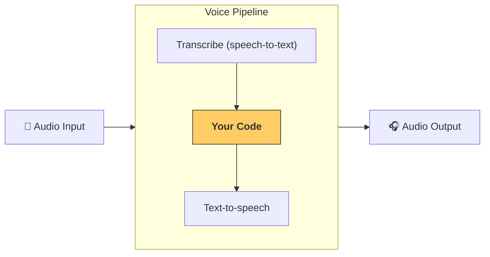

---
search:
  exclude: true
---
# パイプラインとワークフロー

`VoicePipeline` は、 エージェント ワークフローを音声アプリへ簡単に変換できるクラスです。実行したいワークフローを渡すだけで、パイプラインが入力音声の文字起こし、音声終了の検知、適切なタイミングでのワークフロー呼び出し、そしてワークフロー出力を音声へ戻す処理を自動で行います。  



## パイプラインの設定

パイプラインを作成するときには、次の項目を設定できます。

1. [`workflow`][agents.voice.workflow.VoiceWorkflowBase]  
   新しい音声が文字起こしされるたびに実行されるコードです。  
2. 使用する [`speech-to-text`][agents.voice.model.STTModel] と [`text-to-speech`][agents.voice.model.TTSModel] モデル  
3. [`config`][agents.voice.pipeline_config.VoicePipelineConfig]  
   以下のような内容を構成できます。  
   - モデルプロバイダー（モデル名をモデルにマッピングできます）  
   - トレーシング（トレーシングの無効化、音声ファイルのアップロード可否、ワークフロー名、トレース ID など）  
   - TTS と STT モデルの設定（プロンプト、言語、使用するデータ型など）

## パイプラインの実行

パイプラインは [`run()`][agents.voice.pipeline.VoicePipeline.run] メソッドで実行できます。音声入力は次の 2 つの形式で渡せます。

1. [`AudioInput`][agents.voice.input.AudioInput]  
   完全な音声トランスクリプトがある場合に使用し、そのまま結果を生成したいときに便利です。話者が話し終えるタイミングを検知する必要がない、たとえば事前録音された音声やプッシュトゥトーク方式のアプリでユーザーが話し終えるタイミングが明確な場合に適しています。  
2. [`StreamedAudioInput`][agents.voice.input.StreamedAudioInput]  
   ユーザーが話し終えたかどうかを検知する必要がある場合に使用します。音声チャンクを検出次第プッシュでき、パイプラインが「アクティビティ検知」により適切なタイミングでエージェント ワークフローを自動実行します。

## 結果

音声パイプラインの実行結果は [`StreamedAudioResult`][agents.voice.result.StreamedAudioResult] です。これはイベントをストリーム配信できるオブジェクトで、いくつかの [`VoiceStreamEvent`][agents.voice.events.VoiceStreamEvent] が含まれます。

1. [`VoiceStreamEventAudio`][agents.voice.events.VoiceStreamEventAudio] — 音声チャンクを含みます。  
2. [`VoiceStreamEventLifecycle`][agents.voice.events.VoiceStreamEventLifecycle] — ターンの開始・終了などライフサイクルイベントを通知します。  
3. [`VoiceStreamEventError`][agents.voice.events.VoiceStreamEventError] — エラーイベントです。  

```python

result = await pipeline.run(input)

async for event in result.stream():
    if event.type == "voice_stream_event_audio":
        # play audio
    elif event.type == "voice_stream_event_lifecycle":
        # lifecycle
    elif event.type == "voice_stream_event_error"
        # error
    ...
```

## ベストプラクティス

### 割り込み

Agents SDK には現時点で [`StreamedAudioInput`][agents.voice.input.StreamedAudioInput] に対する組み込みの割り込みサポートがありません。検出された各ターンごとにワークフローが個別に実行されます。アプリケーション内部で割り込みを処理したい場合は、[`VoiceStreamEventLifecycle`][agents.voice.events.VoiceStreamEventLifecycle] イベントを監視してください。`turn_started` は新しいターンが文字起こしされ処理が始まったことを示し、`turn_ended` は該当ターンの音声がすべて送信された後に発火します。これらのイベントを利用して、モデルがターンを開始した際に話者のマイクをミュートし、そのターンに関する音声をすべて出力し終えたらアンミュートする、といった制御が可能です。