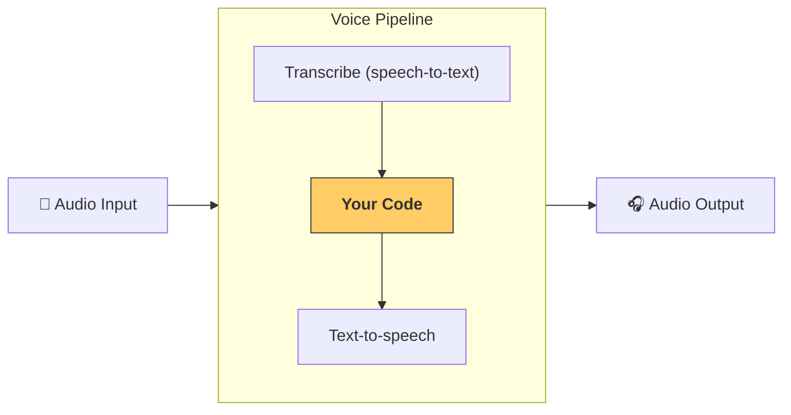

---
search:
  exclude: true
---
# パイプラインとワークフロー

` VoicePipeline ` クラスは、エージェントワークフローを音声アプリに簡単に組み込めます。ワークフローを渡すと、入力音声の文字起こし、音声終了の検出、適切なタイミングでのワークフロー呼び出し、そしてワークフロー出力を音声へ変換する処理をパイプラインが自動で行います。



## パイプラインの設定

パイプラインを作成するときに、次の項目を設定できます。

1. [`workflow`][agents.voice.workflow.VoiceWorkflowBase]  
   新しい音声が文字起こしされるたびに実行されるコードです。  
2. [`speech-to-text`][agents.voice.model.STTModel] と [`text-to-speech`][agents.voice.model.TTSModel]  
   使用するモデルです。  
3. [`config`][agents.voice.pipeline_config.VoicePipelineConfig]  
   以下のような設定が行えます。  
   - モデルプロバイダー: モデル名をモデルにマッピングします。  
   - トレーシング: トレーシングを無効化するか、音声ファイルをアップロードするか、ワークフロー名やトレース ID などを指定できます。  
   - TTS と STT モデルの設定: プロンプト、言語、データ型などを指定します。  

## パイプラインの実行

パイプラインは [`run()`][agents.voice.pipeline.VoicePipeline.run] メソッドで実行します。音声入力は次の 2 つの形式で渡せます。

1. [`AudioInput`][agents.voice.input.AudioInput]  
   音声の全文文字起こしが既にあり、その結果だけを取得したい場合に使用します。事前録音された音声や、プッシュトゥトーク方式でユーザーが話し終えたタイミングが明確な場合などに便利です。  
2. [`StreamedAudioInput`][agents.voice.input.StreamedAudioInput]  
   ユーザーが話し終えたかどうかを検出する必要がある場合に使用します。音声チャンクを検出ごとにプッシュでき、パイプラインが「アクティビティ検出」により適切なタイミングでエージェントワークフローを自動実行します。  

## 結果

音声パイプライン実行の結果は [`StreamedAudioResult`][agents.voice.result.StreamedAudioResult] です。このオブジェクトを通じてイベントをストリーム形式で受け取れます。イベントの種類は [`VoiceStreamEvent`][agents.voice.events.VoiceStreamEvent] がいくつかあります。

1. [`VoiceStreamEventAudio`][agents.voice.events.VoiceStreamEventAudio]  
   音声チャンクを含みます。  
2. [`VoiceStreamEventLifecycle`][agents.voice.events.VoiceStreamEventLifecycle]  
   ターンの開始・終了などライフサイクルイベントを通知します。  
3. [`VoiceStreamEventError`][agents.voice.events.VoiceStreamEventError]  
   エラーイベントです。  

```python

result = await pipeline.run(input)

async for event in result.stream():
    if event.type == "voice_stream_event_audio":
        # play audio
    elif event.type == "voice_stream_event_lifecycle":
        # lifecycle
    elif event.type == "voice_stream_event_error"
        # error
    ...
```

## ベストプラクティス

### 割り込み

Agents SDK には現在、` StreamedAudioInput ` に対する組み込みの割り込みサポートはありません。検出された各ターンごとにワークフローが個別に実行されます。アプリケーション内で割り込みを処理したい場合は、` VoiceStreamEventLifecycle ` イベントを監視してください。` turn_started ` は新しいターンが文字起こしされ、処理が開始されたことを示します。` turn_ended ` は該当ターンの音声がすべて送信された後に発火します。モデルがターンを開始したときにマイクをミュートし、関連する音声をすべて送信し終えた後にマイクをアンミュートする、といった制御にこれらのイベントを利用できます。