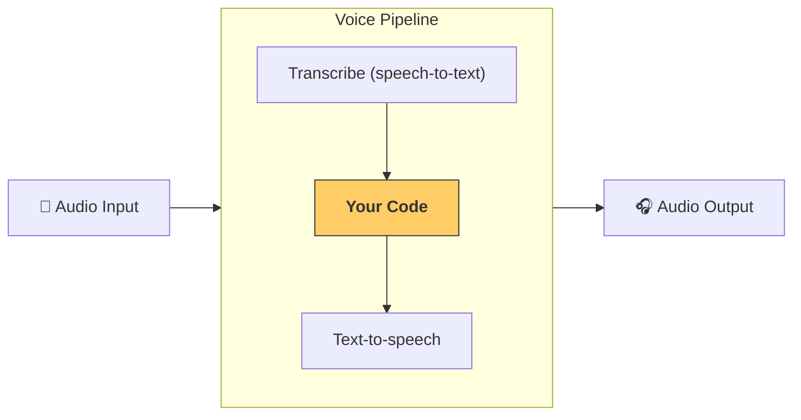

# パイプラインとワークフロー

[`VoicePipeline`][agents.voice.pipeline.VoicePipeline] は、エージェントのワークフローを音声アプリに変換するのを簡単にするクラスです。実行するワークフローを渡すと、パイプラインが入力音声の文字起こし、音声の終了検出、適切なタイミングでのワークフロー呼び出し、ワークフロー出力の音声化を行います。



## パイプラインの設定

パイプラインを作成する際に、以下のことを設定できます：

1. [`workflow`][agents.voice.workflow.VoiceWorkflowBase]：新しい音声が文字起こしされるたびに実行されるコード。
2. 使用する [`speech-to-text`][agents.voice.model.STTModel] および [`text-to-speech`][agents.voice.model.TTSModel] モデル。
3. [`config`][agents.voice.pipeline_config.VoicePipelineConfig]：以下のような設定が可能です。
    - モデルプロバイダー：モデル名をモデルにマッピングできます。
    - トレーシング：トレーシングを無効にするかどうか、音声ファイルのアップロード、ワークフロー名、トレース ID など。
    - TTS および STT モデルの設定：プロンプト、言語、使用するデータ型など。

## パイプラインの実行

パイプラインは [`run()`][agents.voice.pipeline.VoicePipeline.run] メソッドを通じて実行できます。これにより、2 つの形式で音声入力を渡すことができます：

1. [`AudioInput`][agents.voice.input.AudioInput]：完全な音声トランスクリプトがある場合に使用し、その結果を生成するだけです。これは、話者が話し終わったときの検出が不要な場合に便利です。例えば、事前録音された音声や、ユーザーが話し終わったことが明確なプッシュ・トゥ・トークアプリで使用します。
2. [`StreamedAudioInput`][agents.voice.input.StreamedAudioInput]：ユーザーが話し終わったときの検出が必要な場合に使用します。音声チャンクを検出時にプッシュでき、音声パイプラインが自動的にエージェントワークフローを適切なタイミングで実行します。これは「アクティビティ検出」と呼ばれるプロセスを通じて行われます。

## 結果

音声パイプライン実行の結果は [`StreamedAudioResult`][agents.voice.result.StreamedAudioResult] です。これは、イベントが発生するたびにストリーミングできるオブジェクトです。いくつかの種類の [`VoiceStreamEvent`][agents.voice.events.VoiceStreamEvent] があります：

1. [`VoiceStreamEventAudio`][agents.voice.events.VoiceStreamEventAudio]：音声チャンクを含むイベント。
2. [`VoiceStreamEventLifecycle`][agents.voice.events.VoiceStreamEventLifecycle]：ターンの開始や終了などのライフサイクルイベントを通知します。
3. [`VoiceStreamEventError`][agents.voice.events.VoiceStreamEventError]：エラーイベントです。

```python

result = await pipeline.run(input)

async for event in result.stream():
    if event.type == "voice_stream_event_audio":
        # play audio
    elif event.type == "voice_stream_event_lifecycle":
        # lifecycle
    elif event.type == "voice_stream_event_error"
        # error
    ...
```

## ベストプラクティス

### 中断

Agents SDK は現在、[`StreamedAudioInput`][agents.voice.input.StreamedAudioInput] に対する組み込みの中断サポートを提供していません。代わりに、検出されたターンごとにワークフローの別の実行をトリガーします。アプリケーション内で中断を処理したい場合は、[`VoiceStreamEventLifecycle`][agents.voice.events.VoiceStreamEventLifecycle] イベントを監視できます。`turn_started` は新しいターンが文字起こしされ、処理が始まったことを示します。`turn_ended` は、関連するすべての音声が送信された後にトリガーされます。これらのイベントを使用して、モデルがターンを開始したときにスピーカーのマイクをミュートし、関連する音声をすべてフラッシュした後にアンミュートすることができます。