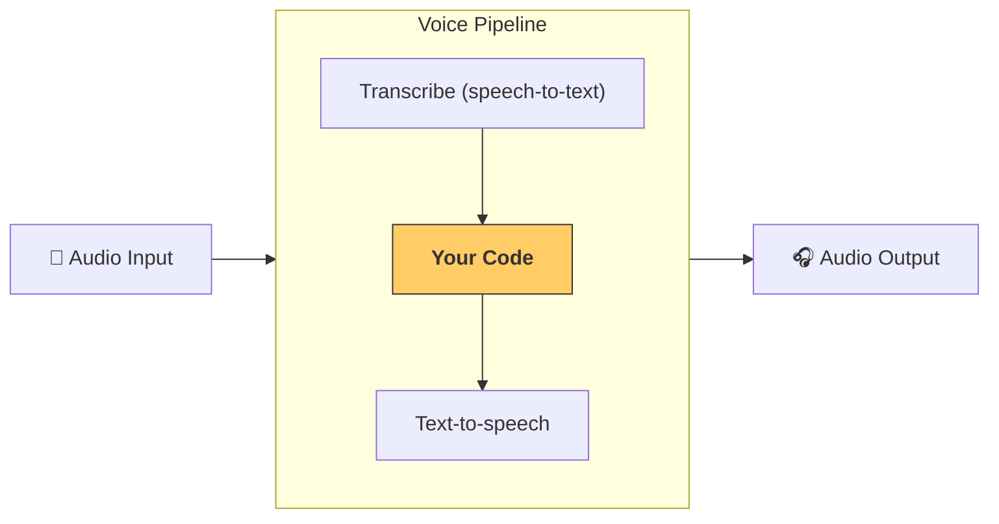

# パイプラインとワークフロー

[`VoicePipeline`][agents.voice.pipeline.VoicePipeline] クラスを使用すると、エージェントのワークフローを簡単に音声アプリに変換できます。実行するワークフローを渡すと、パイプラインが入力音声の文字起こし、音声終了の検出、適切なタイミングでのワークフロー呼び出し、ワークフロー出力の音声への変換を処理します。



## パイプラインの設定

パイプラインを作成する際、以下の項目を設定できます。

1. [`workflow`][agents.voice.workflow.VoiceWorkflowBase]：新しい音声が文字起こしされるたびに実行されるコードです。
2. 使用する [`speech-to-text`][agents.voice.model.STTModel] および [`text-to-speech`][agents.voice.model.TTSModel] モデル
3. [`config`][agents.voice.pipeline_config.VoicePipelineConfig]：以下のような設定が可能です。
    - モデル名をモデルにマッピングするモデルプロバイダー
    - トレーシング（トレーシングの無効化、音声ファイルのアップロード有無、ワークフロー名、トレース ID など）
    - TTS および STT モデルの設定（プロンプト、言語、使用するデータ型など）

## パイプラインの実行

パイプラインは [`run()`][agents.voice.pipeline.VoicePipeline.run] メソッドを使用して実行できます。このメソッドでは、以下の 2 種類の形式で音声入力を渡すことができます。

1. [`AudioInput`][agents.voice.input.AudioInput] は、完全な音声トランスクリプトがあり、それに対する結果を生成したい場合に使用します。これは、話者が話し終えたタイミングを検出する必要がない場合に便利です。例えば、事前録音された音声や、ユーザーが話し終えたタイミングが明確なプッシュトゥトーク型アプリなどです。
2. [`StreamedAudioInput`][agents.voice.input.StreamedAudioInput] は、ユーザーが話し終えたタイミングを検出する必要がある場合に使用します。音声チャンクを検出時に順次送信でき、音声パイプラインは「アクティビティ検出」と呼ばれるプロセスを通じて、適切なタイミングでエージェントのワークフローを自動的に実行します。

## 実行結果

音声パイプラインの実行結果は [`StreamedAudioResult`][agents.voice.result.StreamedAudioResult] です。これは、発生したイベントをストリームとして取得できるオブジェクトです。いくつかの種類の [`VoiceStreamEvent`][agents.voice.events.VoiceStreamEvent] があり、以下を含みます。

1. [`VoiceStreamEventAudio`][agents.voice.events.VoiceStreamEventAudio]：音声チャンクを含むイベントです。
2. [`VoiceStreamEventLifecycle`][agents.voice.events.VoiceStreamEventLifecycle]：ターンの開始や終了など、ライフサイクルイベントを通知します。
3. [`VoiceStreamEventError`][agents.voice.events.VoiceStreamEventError]：エラーイベントです。

```python

result = await pipeline.run(input)

async for event in result.stream():
    if event.type == "voice_stream_event_audio":
        # play audio
    elif event.type == "voice_stream_event_lifecycle":
        # lifecycle
    elif event.type == "voice_stream_event_error"
        # error
    ...
```

## ベストプラクティス

### 割り込み処理

Agents SDK は現在、[`StreamedAudioInput`][agents.voice.input.StreamedAudioInput] に対する組み込みの割り込み処理をサポートしていません。その代わり、検出された各ターンごとにワークフローが個別に実行されます。アプリケーション内で割り込みを処理したい場合は、[`VoiceStreamEventLifecycle`][agents.voice.events.VoiceStreamEventLifecycle] イベントを監視できます。`turn_started` は新しいターンが文字起こしされ、処理が開始されたことを示します。`turn_ended` は、該当するターンのすべての音声が送信された後にトリガーされます。これらのイベントを利用して、モデルがターンを開始した際に話者のマイクをミュートし、ターンに関連するすべての音声を送信した後にミュートを解除する、といった処理が可能です。