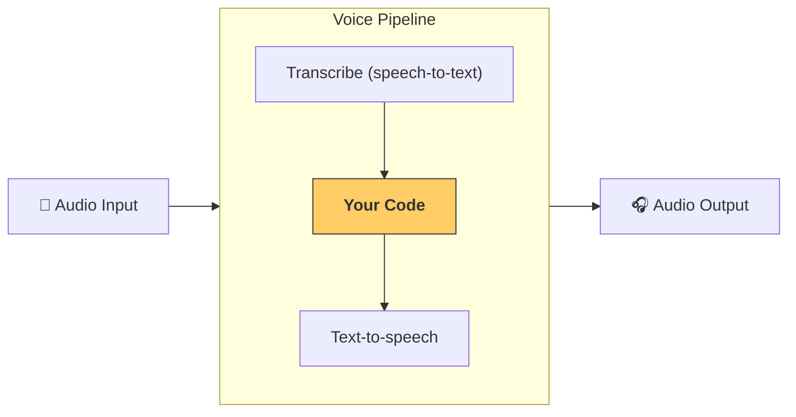

# パイプラインとワークフロー

[`VoicePipeline`][agents.voice.pipeline.VoicePipeline] は、エージェントワークフローを音声アプリに簡単に変換できるクラスです。実行したいワークフローを渡すと、パイプラインが入力音声の文字起こし、音声終了の検出、適切なタイミングでのワークフロー呼び出し、ワークフロー出力の音声化までを自動で処理します。



## パイプラインの設定

パイプラインを作成する際、以下の項目を設定できます。

1. [`workflow`][agents.voice.workflow.VoiceWorkflowBase]：新しい音声が文字起こしされるたびに実行されるコードです。
2. 使用する [`speech-to-text`][agents.voice.model.STTModel] および [`text-to-speech`][agents.voice.model.TTSModel] モデル
3. [`config`][agents.voice.pipeline_config.VoicePipelineConfig]：以下のような設定が可能です。
    - モデルプロバイダー：モデル名をモデルにマッピングできます
    - トレーシング：トレーシングの有効/無効、音声ファイルのアップロード有無、ワークフロー名、トレース ID など
    - TTS および STT モデルの設定：プロンプト、言語、使用するデータ型など

## パイプラインの実行

パイプラインは [`run()`][agents.voice.pipeline.VoicePipeline.run] メソッドで実行できます。音声入力は 2 つの形式で渡せます。

1. [`AudioInput`][agents.voice.input.AudioInput]：完全な音声トランスクリプトがある場合に使用し、その内容に対する結果のみを生成します。話者が話し終えたタイミングを検出する必要がない場合（例：事前録音音声や push-to-talk アプリなど、ユーザーが話し終えたことが明確な場合）に便利です。
2. [`StreamedAudioInput`][agents.voice.input.StreamedAudioInput]：ユーザーが話し終えたタイミングを検出する必要がある場合に使用します。音声チャンクを検出ごとにプッシュでき、VoicePipeline が「アクティビティ検出」と呼ばれるプロセスを通じて、適切なタイミングでエージェントワークフローを自動実行します。

## 結果

VoicePipeline 実行の結果は [`StreamedAudioResult`][agents.voice.result.StreamedAudioResult] です。これは、イベントが発生するたびにストリーミングで受け取れるオブジェクトです。いくつかの種類の [`VoiceStreamEvent`][agents.voice.events.VoiceStreamEvent] があります。

1. [`VoiceStreamEventAudio`][agents.voice.events.VoiceStreamEventAudio]：音声チャンクを含みます。
2. [`VoiceStreamEventLifecycle`][agents.voice.events.VoiceStreamEventLifecycle]：ターンの開始や終了など、ライフサイクルイベントを通知します。
3. [`VoiceStreamEventError`][agents.voice.events.VoiceStreamEventError]：エラーイベントです。

```python

result = await pipeline.run(input)

async for event in result.stream():
    if event.type == "voice_stream_event_audio":
        # play audio
    elif event.type == "voice_stream_event_lifecycle":
        # lifecycle
    elif event.type == "voice_stream_event_error"
        # error
    ...
```

## ベストプラクティス

### 割り込み

Agents SDK は現在、[`StreamedAudioInput`][agents.voice.input.StreamedAudioInput] に対する組み込みの割り込みサポートを提供していません。そのため、検出された各ターンごとにワークフローの個別実行がトリガーされます。アプリケーション内で割り込みを処理したい場合は、[`VoiceStreamEventLifecycle`][agents.voice.events.VoiceStreamEventLifecycle] イベントをリッスンできます。`turn_started` は新しいターンが文字起こしされ、処理が開始されたことを示します。`turn_ended` は該当ターンのすべての音声が送信された後にトリガーされます。これらのイベントを利用して、モデルがターンを開始した際に話者のマイクをミュートし、ターンに関連するすべての音声を送信し終えた後にアンミュートする、といった制御が可能です。