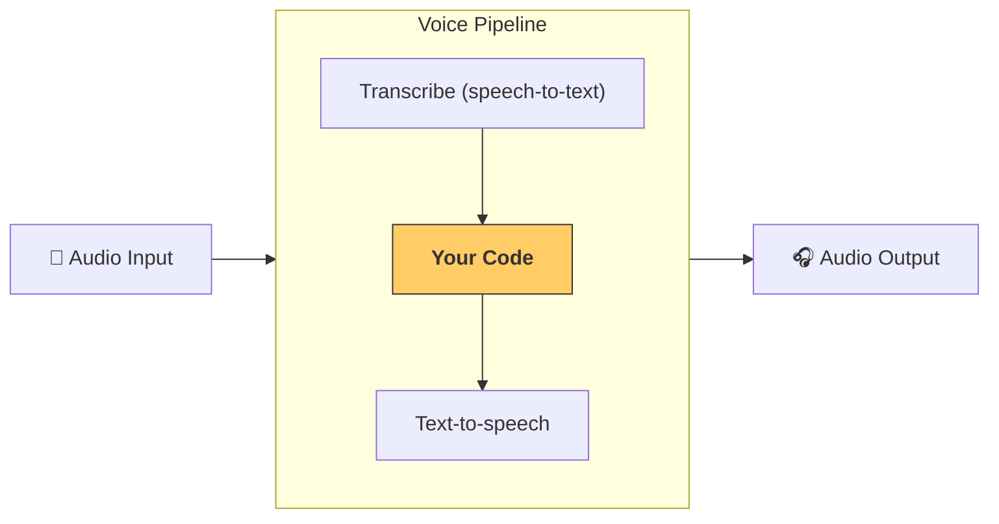

---
search:
  exclude: true
---
# パイプラインと ワークフロー

[`VoicePipeline`][agents.voice.pipeline.VoicePipeline] は、エージェント的なワークフローを音声アプリに簡単に変換できるクラスです。ワークフローを渡すと、パイプラインが入力音声の文字起こし、音声終了の検知、適切なタイミングでのワークフロー呼び出し、そしてワークフロー出力を音声へ変換する処理を担当します。



## パイプラインの設定

パイプラインを作成する際に、以下を設定できます。

1. [`workflow`][agents.voice.workflow.VoiceWorkflowBase] ‐ 新しい音声が文字起こしされるたびに実行されるコード
2. 使用する [`speech-to-text`][agents.voice.model.STTModel] および [`text-to-speech`][agents.voice.model.TTSModel] モデル
3. [`config`][agents.voice.pipeline_config.VoicePipelineConfig] ‐ 以下のような内容を設定可能
    - モデルプロバイダー。モデル名をモデルにマッピングします
    - トレーシング。トレーシングの無効化、音声ファイルのアップロード可否、ワークフロー名、トレース ID など
    - TTS と STT モデルの設定。プロンプト、言語、使用するデータ型など

## パイプラインの実行

パイプラインは [`run()`][agents.voice.pipeline.VoicePipeline.run] メソッドで実行できます。音声入力は次の 2 形式で渡せます。

1. [`AudioInput`][agents.voice.input.AudioInput]  
   完全な音声トランスクリプトがある場合に使用し、その結果だけを生成したいときに便利です。話者の発話終了を検知する必要がないケース、たとえば録音済み音声やプッシュトゥートーク型アプリのようにユーザーが話し終えたタイミングが明確な場合に向いています。
2. [`StreamedAudioInput`][agents.voice.input.StreamedAudioInput]  
   ユーザーの発話終了検知が必要な場合に使用します。検出された音声チャンクを順次プッシュでき、音声パイプラインが「アクティビティ検知」と呼ばれるプロセスを通じて適切なタイミングでエージェント ワークフローを自動的に実行します。

## 結果

音声パイプライン実行の結果は [`StreamedAudioResult`][agents.voice.result.StreamedAudioResult] です。これは発生したイベントをストリーミングで受け取れるオブジェクトです。いくつかの [`VoiceStreamEvent`][agents.voice.events.VoiceStreamEvent] があり、主なものは次のとおりです。

1. [`VoiceStreamEventAudio`][agents.voice.events.VoiceStreamEventAudio] ‐ 音声チャンクを含みます
2. [`VoiceStreamEventLifecycle`][agents.voice.events.VoiceStreamEventLifecycle] ‐ ターンの開始や終了などのライフサイクルイベントを通知します
3. [`VoiceStreamEventError`][agents.voice.events.VoiceStreamEventError] ‐ エラーイベントです

```python

result = await pipeline.run(input)

async for event in result.stream():
    if event.type == "voice_stream_event_audio":
        # play audio
    elif event.type == "voice_stream_event_lifecycle":
        # lifecycle
    elif event.type == "voice_stream_event_error"
        # error
    ...
```

## ベストプラクティス

### 割り込み

Agents SDK は現在 [`StreamedAudioInput`][agents.voice.input.StreamedAudioInput] に対して、組み込みの割り込み処理をサポートしていません。そのため、検出された各ターンごとにワークフローが個別に実行されます。アプリケーション内で割り込みを処理したい場合は、[`VoiceStreamEventLifecycle`][agents.voice.events.VoiceStreamEventLifecycle] イベントを監視できます。`turn_started` は新しいターンが文字起こしされ、処理が開始されたことを示します。`turn_ended` は該当ターンのすべての音声が送信された後にトリガーされます。たとえば、モデルがターンを開始した際にスピーカーのマイクをミュートし、そのターンに関連する音声をすべて送信し終えた後にアンミュートするといった制御に、これらのイベントを利用できます。